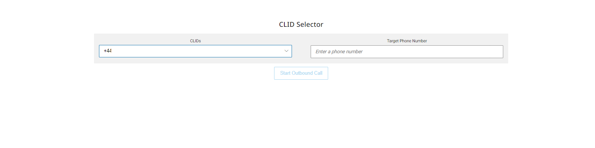

# CLID Selector Widget

## Description

This custom widget gives Agents/Supervisors the functionality to:

- Utilize the Workspaces Widget Framework methods to set the Caller ID before
    - Starting Outbound Voice Interaction
    - Transferring to External Number
    - Consulting an External Number

## Technical Details

The widget uses mainly the `AXP Public Admin APIs`, while also using the `Workspaces Widget Framework SDK`.

Below are the APIs utilized.

### Workspaces Widget Framework SDK

- ```onDataEvent("onAgentStateEvent", callback)``` - to subscribe to change in Agent's state (logged in, ready, not ready, etc..).
- ```getConfiguration().user``` - to get the full logged in Agent configuration.
- ```getCapabilities()``` - to get the Agent's capabilities to know whether the agent can use VOICE channels.


### Admin APIs

- [```Authorization```](https://developers.avayacloud.com/onecloud-ccaas/docs/how-to-authenticate-with-ccaas-apis#client-credentials-grant) - to acquire the access token to be used across all the API calls.
- [```List Phone Numbers```](https://developers.avayacloud.com/onecloud-ccaas/reference/searchphonenumbers) - to get the available administered phone numbers

## Configuration & Installation

The widget is composed of two components, the widget itself (`bundles.js`) file and a backend component for authorization with AXP, as well as proxying the Admin API requests. Both components are NOT multi-tenanted and need to be deployed an instance per tenant.

As a pre-requisite you need to acquire the AXP Client Credentials `(CLIENT_ID and CLIENT_SECRET)` to be able to use the widget. You will need a `client_credentials` grant type as well.

You will also need to have `Node.js` installed on `v18.0+`

### Running the backend component

Refer to the AXP Proxy API build & deploy guide available [```here```](https://github.com/AvayaExperiencePlatform/axp-api-proxy)


### Building the widget bundle.js file for your tenant

The bundle.js file is built out of this react-app 

To build the widget `bundle.js` file, you need to
- Navigate to `src/app/config.js`
- Update the configuration in there to match your tenant, for example:
  - ```js
        export default {
            env: {
                AXP_CLIENT_ID: "YOUR_AXP_CLIENT_ID",
                AXP_PROXY_BASE_URL: "https://your_server_fqdn_running_axp-proxy-api:3001",
                AXP_ACCOUNT_ID: "ABCDEF",
            },
        };
    ```

- After updating that file, you can now run `yarn install` to install the libraries and package dependencies.
- Run `npm run prod` to build the bundle.js file, it will be in the build/ folder.

## Dockerized Hosting

### Build & Develop
After you make the changes as required by the widget you want to build, you can build and deploy your widget following the below steps

### Prerequisites
- `Node.js` version 18+ is required.
- `Docker` & `Docker Compose`.
- SSL Certificate & Key to serve the built files.
- Upload the `clid-selector-widget.json` file into the `Avaya Experience Platform` Admin Portal -> Widget Management.

---
### Follow the following steps
1. Update the `docker-compose-dev.yml` file with the location of the SSL certificates.
2. ```sh
    yarn install
    npm run build
    docker-compose -f docker-compose-dev.yml up # add -d to run in a background process
    ```
3. After a change, just run ```npm run build``` and refresh your workspaces, all done!
---

If you've done everything correctly, It should look something like this (default without any changes).




## Manual Hosting

### Hosting the Widget

The widget can be served using any webserver and it should server the file
- bundle.js

Below is an Example for `NGINX` configuration of hosting the bundle.js file


```nginx
server {
    listen 8443 ssl;
    ssl_certificate /etc/nginx/cer.cer;
    ssl_certificate_key /etc/nginx/key.key;
    add_header Access-Control-Allow-Origin *;
    root /home/username/Projects/clid-dialing-widget/build; # Path to the folder including bundle.js file
    autoindex on;
}
```